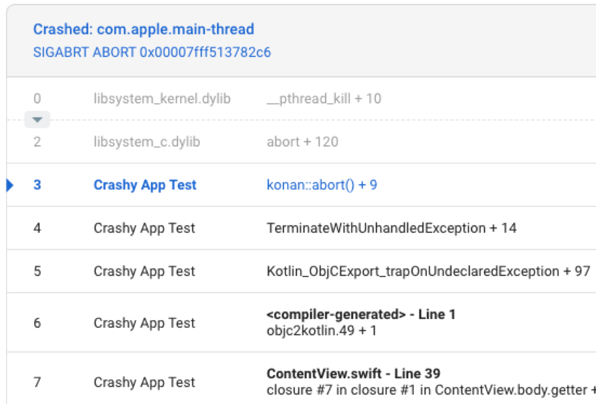

# CrashKiOS - Crash reporting for Kotlin/iOS

Thin library that provides symbolicated crash reports for Kotlin code on iOS. Supports sending crashes, and handled exceptions, as well as logging breadcrumbs and custom key/value pairs. Currently supported crash reporting services are [Firebase Crashlytics](https://firebase.google.com/) and [Bugsnag](https://www.bugsnag.com/).

To use crash reporting with general logging support, check out [Kermit](https://github.com/touchlab/Kermit/).

## The Problem

Crash reporter clients on iOS take the stack of active threads at the moment of crash. Kotlin on iOS, like Kotlin on the JVM, bubbles exceptions up until they are caught or reach the top of the call stack, at which point an unhandled exception hook is called. Because this differs from how iOS works, the crash report shows the point at which we call into Kotlin from Swift/Objc.



We want to get the caught exception and record that instead:


That's what this library is for.

## Crashlytics Usage

Add the dependency.

```kotlin
val commonMain by sourceSets.getting {
    dependencies {
        implementation("co.touchlab.crashkios:crashlytics:x.y.z")
    }
}
```

For both Android and iOS, you must call the following:

```kotlin
enableCrashlytics()
```

On iOS, you should also set the unhandled exception hook:

```kotlin
setCrashlyticsUnhandledExceptionHook()
```

Once initialized, you call methods on `CrashlyticsKotlin`

```kotlin
CrashlyticsKotlin.logMessage("Some message")
CrashlyticsKotlin.sendHandledException(Exception("Some exception"))
CrashlyticsKotlin.sendFatalException(Exception("Some exception"))
CrashlyticsKotlin.setCustomValue("someKey", "someValue")
```

### Testing

Your test code should not call `enableCrashlytics()`. Before calling `enableCrashlytics()`, calls to `CrashlyticsKotlin` are all no-ops. Also, on iOS, avoiding `enableCrashlytics()` means you don't need to worry about Crashlytics linker issues.

### Linking

If you are using dynamic frameworks, you'll see a linker error when building your framework.

```
Undefined symbols for architecture x86_64:
  "_OBJC_CLASS_$_FIRStackFrame", referenced from:
      objc-class-ref in result.o
  "_OBJC_CLASS_$_FIRExceptionModel", referenced from:
      objc-class-ref in result.o
  "_OBJC_CLASS_$_FIRCrashlytics", referenced from:
      objc-class-ref in result.o
  "_FIRCLSExceptionRecordNSException", referenced from:
      _co_touchlab_crashkios_crashlytics_FIRCLSExceptionRecordNSException_wrapper0 in result.o
ld: symbol(s) not found for architecture x86_64
```

To resolve this, you should tell the linker that Crashlytics will be added later. To do that, call `crashlyticsLinkerConfig()` in the `kotlin` section of your `build.gradle.kts`.

## Bugsnag Usage

Add the dependency.

```kotlin
val commonMain by sourceSets.getting {
    dependencies {
        implementation("co.touchlab.crashkios:bugsnag:x.y.z")
    }
}
```

Bugsnag is somewhat more complex than Crashlytics. On startup, on iOS only, the library needs to suppress an extra error report from being sent. That requires some extra calls on iOS, or you can use a helper function that will handle the calls.

The detailed calls you need to make are the following:

In the iOS init, before starting Bugsnag, you need to call `configureBugsnag` with an instance of `BugsnagConfiguration`. The simplest way to get `BugsnagConfiguration` from Swift is by calling:

```swift
let config = BugsnagConfiguration.loadConfig()
```

Call `configureBugsnag` with that config. This *must* be called before starting Bugsnag.

```swift
BugsnagConfigKt.configureBugsnag(config: config)
```

Start Bugsnag

```swift
Bugsnag.start(with: config)
```

Then set the default exception handler hook

```swift
BugsnagConfigKt.setBugsnagUnhandledExceptionHook()
```

Alternatively, call the helper function

```swift
BugsnagConfigKt.startBugsnag(config: config)
```

That function calls `configureBugsnag`, `Bugsnag.start`, and `setBugsnagUnhandledExceptionHook`.

For both Android and iOS, you must call the following:

```kotlin
enableBugsnag()
```

Once initialized, you call methods on `BugsnagKotlin`

```kotlin
BugsnagKotlin.logMessage("Some message")
BugsnagKotlin.sendHandledException(Exception("Some exception"))
BugsnagKotlin.sendFatalException(Exception("Some exception"))
BugsnagKotlin.setCustomValue("someKey", "someValue")
```

### Testing

You test code should not call `enableBugsnag()`. Before calling `enableBugsnag()`, calls to `BugsnagKotlin` are all no-ops. Also, on iOS, avoiding `enableBugsnag()` means you don't need to worry about Bugsnag linker issues.

### Linking

If you are using dynamic frameworks, you'll see a linker error when building your framework.

```
Undefined symbols for architecture x86_64:
  "_OBJC_CLASS_$_BugsnagFeatureFlag", referenced from:
      objc-class-ref in libco.touchlab.crashkios:bugsnag-cache.a(result.o)
  "_OBJC_CLASS_$_BugsnagStackframe", referenced from:
      objc-class-ref in libco.touchlab.crashkios:bugsnag-cache.a(result.o)
  "_OBJC_CLASS_$_BugsnagError", referenced from:
      objc-class-ref in libco.touchlab.crashkios:bugsnag-cache.a(result.o)
  "_OBJC_CLASS_$_Bugsnag", referenced from:
      objc-class-ref in libco.touchlab.crashkios:bugsnag-cache.a(result.o)
      objc-class-ref in libco.touchlab:kermit-bugsnag-cache.a(result.o)
ld: symbol(s) not found for architecture x86_64
```

To resolve this, you should tell the linker that Bugsnag will be added later. To do that, call `bugsnagLinkerConfig()` in the `kotlin` section of your `build.gradle.kts`.

## NSExceptionKt

CrashKiOS and Kermit previously created 2 reports on a crash because none of the crash reporting clients had an obvious way to do one. [Rick Clephas](https://github.com/rickclephas) has done some excellent work figuring that out with [NSExceptionKt](https://github.com/rickclephas/NSExceptionKt). CrashKiOS now uses part of that library as a base and we've merged the cinterop from Kermit and NSExeptionKt to handle crashes as well as breadcrumb values and log statements.
