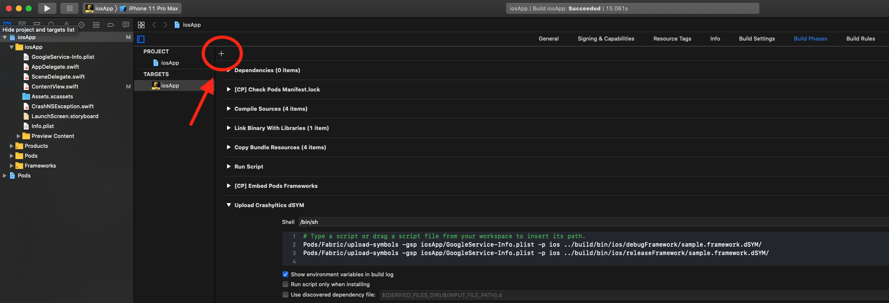

# CrashKiOS - Crash reporting for Kotlin/iOS

Thin library that provides symbolicated crash reports for Kotlin code on 
iOS. Currently implemented for Crashlytics and Bugsnag.

> ## **We're Hiring!**
>
> Touchlab is looking for a Mobile Developer, with Android/Kotlin experience, who is eager to dive into Kotlin Multiplatform Mobile (KMM) development. Come join the remote-first team putting KMM in production. [More info here](https://go.touchlab.co/careers-gh).

## The Problem

Kotlin's design has obviously been influenced by Java. In Java, exceptions
are a normal thing, and further in Kotlin, checked exceptions aren't a thing.
Crash reporters (Crashlytics, Bugsnag, etc) can take the unhandled exceptions
and provide the full stack trace.

On iOS, exceptions exist, but they're very much a special case. When a "crash" happens, 
the app stops, and crash reporting tools take the state of the application threads.
When calling into Kotlin code, if a crash happens in the Kotlin code, the exception 
bubbles back up to the iOS/Kotlin interface, at which point, if not @Throws, the app
is forcibly crashed. You can see the crash info from the local device and from the app store, 
assuming the user reported it, but crash reporting services like Crashlytics and Bugsnag 
only get the stack trace from the iOS/Kotlin interface. Not where the crash actually happened.

TL;DR, you'll see this:


You *want* to see this:


That's what this library is for.

## The Solution

 With some stack trace visibility improvements included in Kotlin 1.3.60, we can report 
 "handled errors" to Crashlytics and Bugsnag, and have them record symbolicated crash reports.
 These can be sent explicitly, but more likely, reported as part of the uncaught exception handler.
 
 ## Usage
 
 The crash library itself is minimal, but because of current transitive code rules and how interop 
 works with Objc and Swift, we'll be copying some code manually.
 
 ### Gradle
 
 ```groovy
kotlin {
    sourceSets {
        iosMain {
            dependencies {
                api "co.touchlab:crashkios:0.3.2"
            }
        } 
    }
}
```
 
 ### Kotlin
 
 In your app, you'll need to include some extra passthrough code. In your iOS Kotlin source, add the 
 following function
 
 ```kotlin
import co.touchlab.crashkios.CrashHandler
import co.touchlab.crashkios.setupCrashHandler

fun crashInit(handler: CrashHandler){
    setupCrashHandler(handler)
}
```

In our sample, we put this in a file called `CrashIntegration.kt`. If it's in a different file, you'll
need to know that for the Swift config. [See CrashIntegration.kt](sample/src/iosMain/kotlin/sample/CrashIntegration.kt)

This will be called from your iOS code to set the default crash handler. There are other options,
but this is generally what you want to do. The name `crashInit` is unimportant, but creating this
method forces the Kotlin compiler to include the necessary crash handling code. In the future, with 
proper transitive dependency settings, this may not be necessary.

### Swift

In Swift, you need to add a `CrashHandler` instance specific to the crash reporting service you'll 
be using. We currently support Crashlytics and Bugsnag. Setup currently involves copy/pasting some
Swift/Objc code rather than using interop bindings in Kotlin. This is more manual, but simpler. We 
may add interop code in the future.

#### Crashlytics

Create the `CrashHandler` class

```swift
class CrashlyticsCrashHandler: CrashkiosCrashHandler {
    override func crashParts(
        addresses: [KotlinLong],
        exceptionType: String,
        message: String) {
        let clsStackTrace = addresses.map {
            CLSStackFrame(address: UInt(truncating: $0))
        }

        Crashlytics.sharedInstance().recordCustomExceptionName(
            exceptionType,
            reason: message,
            frameArray: clsStackTrace
        )
    }
}
```

Note, `CrashkiosCrashHandler` and possibly `KotlinLong` may have different generated names from
the Kotlin compiler output.

Inside `AppDelegate.swift`, or wherever you do app setup, add the following:

```swift
    CrashIntegrationKt.crashInit(handler: CrashlyticsCrashHandler())
```

To see all of this code in a sample app, see [sample/iosAppCrashlytics](sample/iosAppCrashlytics)

#### Bugsnag

Bugsnag's setup is a little more complicated. We create an extension of `NSException` which is provided
to the Bugsnag crash reporting library.

In Swift, add the following:

```swift
class CrashNSException: NSException {
    init(callStack:[NSNumber], exceptionType: String, message: String) {
        super.init(name: NSExceptionName(rawValue: exceptionType), reason: message, userInfo: nil)
        self._callStackReturnAddresses = callStack
    }
    
    required init?(coder: NSCoder) {
        fatalError("init(coder:) has not been implemented")
    }
    
    private lazy var _callStackReturnAddresses: [NSNumber] = []
    override var callStackReturnAddresses: [NSNumber] {
        get { return _callStackReturnAddresses }
        set { _callStackReturnAddresses = newValue }
    }
}

class BugsnagCrashHandler: CrashkiosCrashHandler {
    override func crashParts(addresses: [KotlinLong], exceptionType: String, message: String) {
        Bugsnag.notify(CrashNSException(callStack: addresses, exceptionType: exceptionType, message: message))
    }
}
```

Note, `CrashkiosCrashHandler` and possibly `KotlinLong` may have different generated names from
the Kotlin compiler output.

Inside `AppDelegate.swift`, or wherever you do app setup, add the following:

```swift
    CrashIntegrationKt.crashInit(handler: BugsnagCrashHandler())
```

To see all of this code in a sample app, see [sample/iosAppBugsnag](sample/iosAppBugsnag)

## Status

Release builds will show method names from the stack, but not line numbers. Debug builds include line numbers. There may be a setting to 
change that, but we haven't found it yet.

We currently add the following config to each build binary. We still need to experiment and may be able to remove some
of the config.

```groovy
freeCompilerArgs += "-Xg0"
if(it instanceof org.jetbrains.kotlin.gradle.plugin.mpp.Framework) {
    isStatic = true
}
```

### Upload dSYMs to Crashlytics

If you find that you're missing events, or you're getting a warning message in the Crashlytics dashboard about missing dSYMs, then following instructions can help you ensure that Crashlytics always has your most up-to-date dSYMs.

In Xcode, select the iosApp project on the lefthand side, then switch to the Build Phases tab. Beneath that, on the left, is a "+" button (circled in the image below). Select that, and then in the dropdown menu that appears, select "New run script phase". Name the new script something along the lines of "Upload Crashlytics dSYMs", or something similarly descriptive.



Paste in the following script:

```Pods/Fabric/upload-symbols -gsp iosApp/GoogleServiceInfo.plist -p ios ../build/bin/ios/debugFramework/sample.framework.dSYM/
Pods/Fabric/upload-symbols -gsp iosApp/GoogleService-Info.plist -p ios ../build/bin/ios/releaseFramework/sample.framework.dSYM/
```

Note a few things about this script:

- It will upload both your debug and release dSYMs every time you run your project in order to ensure that Firebase has any and all relevant dSYMs.
- Depending on the configuration of your project, the relative paths in the script may need to be different. Ensure that you're pointing to the following:
  - GoogleService-Info.plist
  - Debug [shared_library_name].framework.dSYM
  - Release [shared_library_name].framework.dSYM

If the folder structure of your shared Kotlin library is different than what it is here, or you're having difficulty finding your dSYMs for any reason, you can use the following script to print a list of them:

```find ../build -name "*.dSYM"```

Note again that the `../build` relative path is configured to this repository's structure. Be sure that the script points to your Kotlin library's `/build` folder, which may be somewhere else, based on the configuration of your project.

The primary resource for these tips was [this page of Firebase's Crashlytics guide](https://firebase.google.com/docs/crashlytics/get-deobfuscated-reports).
