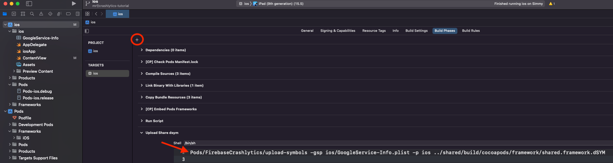

# Crashlytics

If you use Crashlytics and an uncaught exception gets thrown from shared Kotlin code running on iOS, the crash report generated 
won't be very helpful in determining the cause, see [The Problem](misc/THE_PROBLEM.md) for more details. CrashKiOS was made 
to remedy this issue and provide meaningful stack traces for Kotlin crashes. 

## Step 1 - Add Crashlytics to Your Apps
First you'll need to set up Crashlytics for your Android and iOS individually. Follow the steps in the [firebase docs](https://firebase.google.com/docs/crashlytics/get-started?platform=ios)
to set up Crashlytics with your Android app the normal way then do the same for your iOS app. Note, if your repo is 
public, you probably want to make sure to add Android's `google-services.json` and iOS's `GoogleService-info` files to your 
gitignore.  

Make sure to force a crash on both apps from non-shared code and ensure the crash shows up on the Crashlytics Console. 
If you're testing a crash on an iOS simulator, you'll need to hit run to build your changes, then close and reopen the app. Otherwise,
Xcode will catch and swallow your crash and it won't get reported. You'll also need to reopen the app after crashing it because
crash reports are sent at app startup. You'll also need to make sure you aren't crashing the app at app start which can cause it to 
not get reported. Make sure the crash is triggered by some action like a button click. Also don't forget to setup automatic
dSYM uploading so you can see proper stack traces for Swift code.

## Step 2 - Add CrashKiOS  
Once you've verified Crashlyitcs is working for both platforms, you can add the CrashKiOS dependency to `commonMain` in your
shared module. 
```kotlin
val commonMain by sourceSets.getting {
    dependencies {
        implementation("co.touchlab.crashkios:crashlytics:{{LATEST_GITHUB_VERSION}}")
    }
}
```
Then disable caching in your `gradle.properties` file. We're currently working to update things to avoid this, for now 
we need it to deal with iOS linking issues.
```
kotlin.native.cacheKind.iosX64=none
kotlin.native.cacheKind.iosSimulatorArm64=none
```

After a Gradle sync, make a call to `enableCrashlytics()` somewhere in your startup code for each app. This switches from the
default no-op implementations to real implementations which avoid issues in testing. Depending on how the `cacheKind` issue 
above is fixed this may no longer be necessary. 

Make sure everything works so far by sending a handled exception from shared code and checking that it shows up in your 
Crashlytics dashboard for both platforms.
```kotlin
CrashlyticsKotlin.sendHandledException(Exception("Some exception"))
```

That's all that's needed to handle uncaught exceptions on Android, but for iOS we need to catch unhandled Kotlin exceptions 
that come from hard crashes. In startup code for iOS, call `setCrashlyticsUnhandledExceptionHook()`. We usually make a helper 
function in `iOSMain` with both setup steps, then call that from iOS app startup: 
```kotlin
fun setupCrashlytics() {
    enableCrashlytics()
    setCrashlyticsUnhandledExceptionHook()
}
```

Once this is done, throw an uncaught exception from Kotlin code on iOS. Reminder this needes to happen through user action, 
not in startup code and you need to relaunch the app after building and after crashing to send the report. The crash should show 
up on the dashboard and should now have Kotlin line numbers 

## Step 3 - Setup Dynamic Linking (Optional) 
If you're ok with using static frameworks for your shared code, you're done with setup. If you want to export a dynamic framework then you'll see an error like this: 
```
Undefined symbols for architecture x86_64:
  "_OBJC_CLASS_$_FIRStackFrame", referenced from:
      objc-class-ref in result.o
  "_OBJC_CLASS_$_FIRExceptionModel", referenced from:
      objc-class-ref in result.o
  "_OBJC_CLASS_$_FIRCrashlytics", referenced from:
      objc-class-ref in result.o
  "_FIRCLSExceptionRecordNSException", referenced from:
      _co_touchlab_crashkios_crashlytics_FIRCLSExceptionRecordNSException_wrapper0 in result.o
ld: symbol(s) not found for architecture x86_64
```
This is because on iOS only the definitions for Crashlytics are added when comiling the Kotlin code and building the framework. The binary (the actual Crashlytics library) isn't added until later when you build the iOS app. When building a dynamic framework, the Kotlin compile expects to be able to resolve everything, so you'll see the above error because Crashlytics isn't there yet. 

To workaround this, we need to tell the compiler that these symbols are find and will be there later. Doing it manually is a bit messy so you can just add our gradle plugin to handle it 
```kotlin
  id("co.touchlab.crashkios.crashlyticslink") version "{{LATEST_GITHUB_VERSION}}"
```

## Step 3b - Send dSYMS for Dynamic Framework
If you're using a dynamic framework you may also see a warning on the Crashlytics dashboard about missing dSYMS or "Missing UUID" in the stack trace of Kotlin crashes. If that happens adding a build phase to push the Kotlin framework dSYM to Crashlytics separately should resolve it. 

In Xcode, select your project on the left sidebar, open the Build Phases Tab, and press the `+` in the top left. The select 
"New Run Script Phase" and give it a name like "Upload Kotlin dSYM".
Add this script to the build phase 
```bash
Pods/FirebaseCrashlytics/upload-symbols -gsp ios/GoogleService-Info.plist -p ios ../shared/build/cocoapods/framework/shared.framework.dSYM
```


You may need to make slight changes to this script to fit your project. In The snippet above we're using `shared` as our 
Kotlin module and framework name, and we're exporting to iOS using CocoaPods. Make sure the directory and framework name 
matches what's in your project by looking in the build folder for your Kotlin module and getting the relative path. 
If you're not using CocoaPods, you may need to find the dSYMs your project generates and make sure to upload each one 
separately with the above command. Use this in the shared Kotlin module's directory to get a lis of all of the dSYMs 
```bash
find ./build -name "*.dSYM"
```

## Sending Extra Info to Crashlytics
CrashKiOS-crashlytics also provides shared code wrappers for sending logs and  custom key values to Crashlytics. When there is a crash, these will show up in the Logs and Keys tabs on the dashboard respectively. 
```kotlin
CrashlyticsKotlin.logMessage("Some message")
CrashlyticsKotlin.setCustomValue("someKey", "someValue")
```